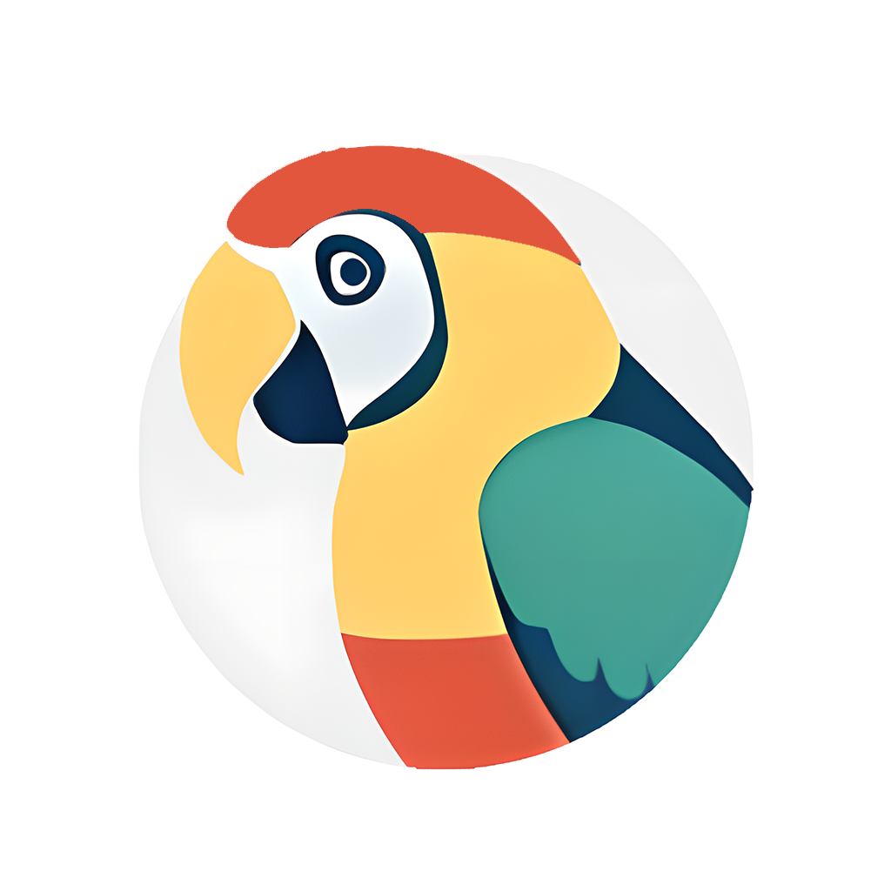

# 语鹦助手
   

## 📌 项目概述

语鹦助手是一个跨平台的免费开源AI应用程序，是一个聊天，英语学习的工具。该项目基于Flutter开发，用于本地与llama.cpp模型接口，以及远程与Ollama、Mistral、Google Gemini和OpenAI模型接口。

## 🚀 快速开始

### 前提条件

- [操作系统要求]（Android、Windows、macOS、Linux、iOS(开发中)）
- [必要的软件或库]（Flutter 3.16+）

### 安装步骤

1. 克隆仓库
   ```bash
   git clone https://gitee.com/alexcai/parrot_app.git
   cd parrot_app
   ```

2. 安装依赖Flutter

   <a href="https://docs.flutter.cn/get-started/install">
   https://docs.flutter.cn/get-started/install
   </a>


3. 运行应用
   ```bash
   # 查看你的设备列表
   flutter devices
   # 请修改deviceId
   flutter run -d deviceId
   ```

## 🎯 目标和愿景

- [x] 中文版支持
- [ ] 测试各平台可用
- [ ] 语音朗读
- [ ] 英文对话提示

## 📘 文档

- <a href="./docs/API-Compatability.xls">API 文档链接</a> 

## 👥 社区和支持

- 合作请联系 QQ:121237385
- 贡献者可以通过提交 Pull Request 来参与项目。
- 如果你发现了 bug 或有功能建议，请通过 [Gitee Issues](https://gitee.com/alexcai/parrot_app/issues) 报告。

## 🔑 贡献者指南

- 请联系 QQ:121237385 申请加入种子用户群

## 🙏 致谢

- 感谢所有参与此项目的贡献者。
- 感谢 Dane Madsen。 
- <a href="https://github.com/flutter/flutter">Flutter社区</a>
- <a href="https://github.com/davidmigloz/langchain_dart">davidmigloz/langchain_dart</a>